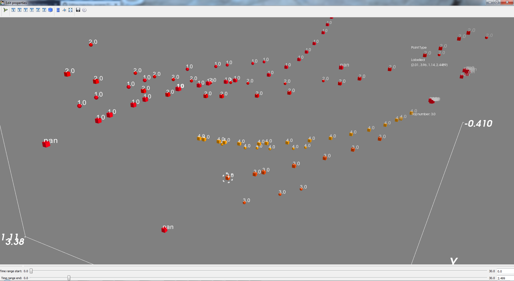
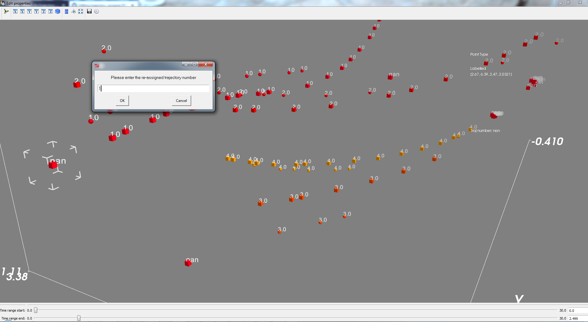

# trajectory-assigner
A Mayavi based visualisation tool that allows the visualisation and re-assignment of a trajectory label when there are two
sets of sources for the same trajectory/ies

Use case :
When an object's position is being estimated by two tracking systems, eg. video and acoustic tracking - it can be tricky to assign the positions from either system to the same trajectory. This module assumes a *known* source of trajectory points that have reliable trajectory tags (eg. those from video tracking), and a *labelled* set of trajectory points that have been assigned manuall or automatically, but may be unreliable (eg. those from acoustic tracking). 

### What it does : 
The current version of the module allows a user to :
1) visualise both *known* and *labelled* points
2) Interactively display a subset of points based on the chosen time range through the user interface
3) Point information is displayed when the user left-clicks on a point
4) Trajectory tag reassignment is done by right-clicking on a *labelled* point. 

### What it does not do:
1) Deletion of points
2) Addition of points
3) Trajectory reassignment of *known* points 

### Usage : 
Initiate a TrajCleaner instance 
        
        traj_cleaner = TrajCleaner()
        
        # assign the labelled and known trajectory datasets to the instance 
        
         traj_cleaner.knwntraj_data = kn_data
         traj_cleaner.labtraj_data = lab_data
         
Begin the Mayavi interactive visualisation
        
        traj_cleaner.configure_traits()
        
 
In this screenshot, a *known* trajectory point #6 has been left-button clicked, and the information 
is displayed on the top right. The tuple with 4 entries shows the x,y,z and timestamp of the position 
at recording/emission (depending on the tracking system)

 
 A *labelled* trajectory point #9 is being re-assigned by a right-click. 
 
After checking the trajectory assignment and performing reassignment close the
Mayavi window and save the labld_traj pd.DataFrame to a csv 
        
        traj_cleaner.labld_traj.to_csv('labelled_traj_verified.csv')
        
User-controlled parameters :
        
     tag_offset : the distance between the numeric trajectory tag and 
                     the displayed trajectory points
        
     tag_size : size of the numeric trajectory tag

## Installation : 
The primary visualisation package to visualise the data is Mayavi 4.5. As of now the whole module has been written and tested on a Windows 7 64bit, Python 2.7.14 system. Installing Mayavi can be tricky if done the 'normal' way through a standard pip/conda install because of complicated package dependencies.

I've managed installing Mayavi into a conda environment (or perhaps a virtualenv too). Instructions for installing Mayavi are found [here](http://docs.enthought.com/mayavi/mayavi/installation.html). In addition to Mayavi (and its dependences), trajcleaner also relies on Pandas, which needs to be additionally downloaded. If using an Anaconda based Python installation, to replicate the environment used to build trajcleaner in a Windows 64bit system - please use the *mayavi_reqpkgs_spec_file.txt* and run this command in Anaconda Prompt : 
 
        conda create --name <env> --file <this file>
 
